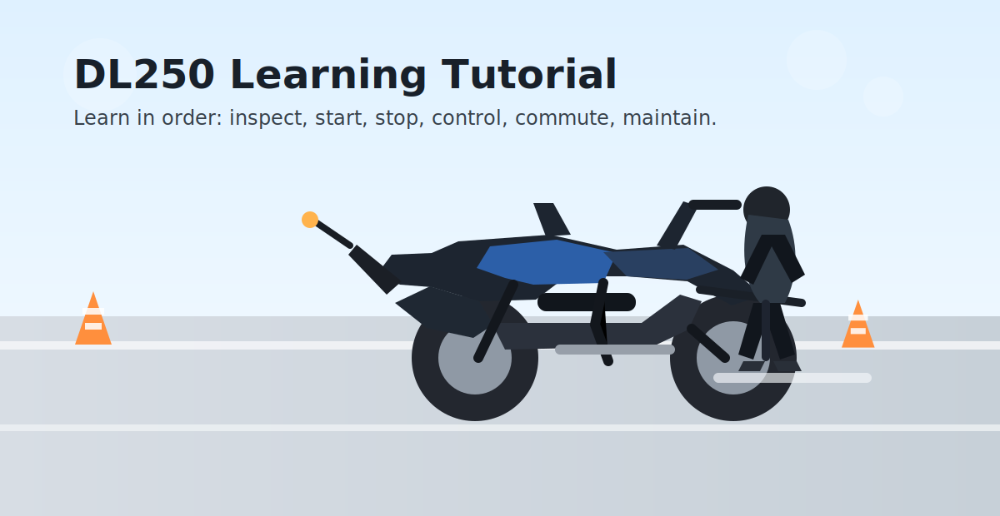
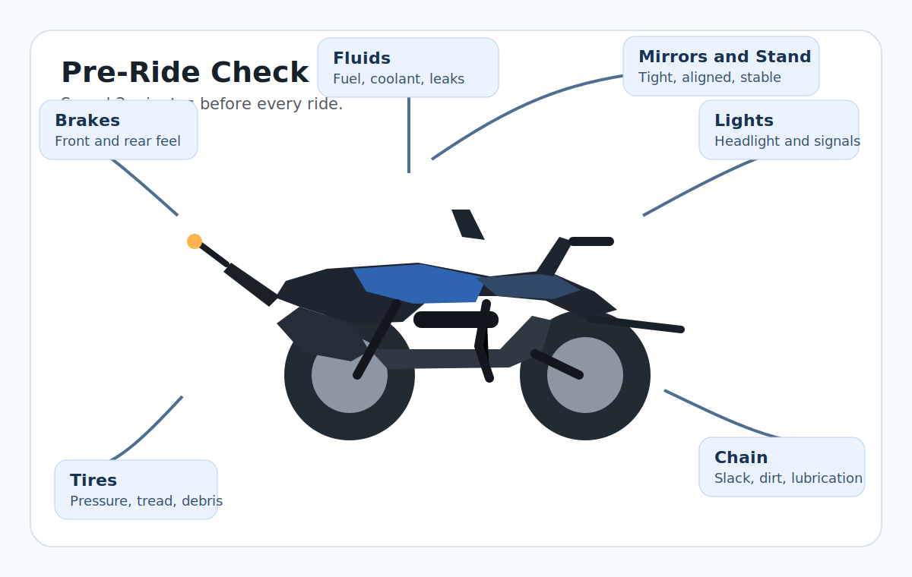
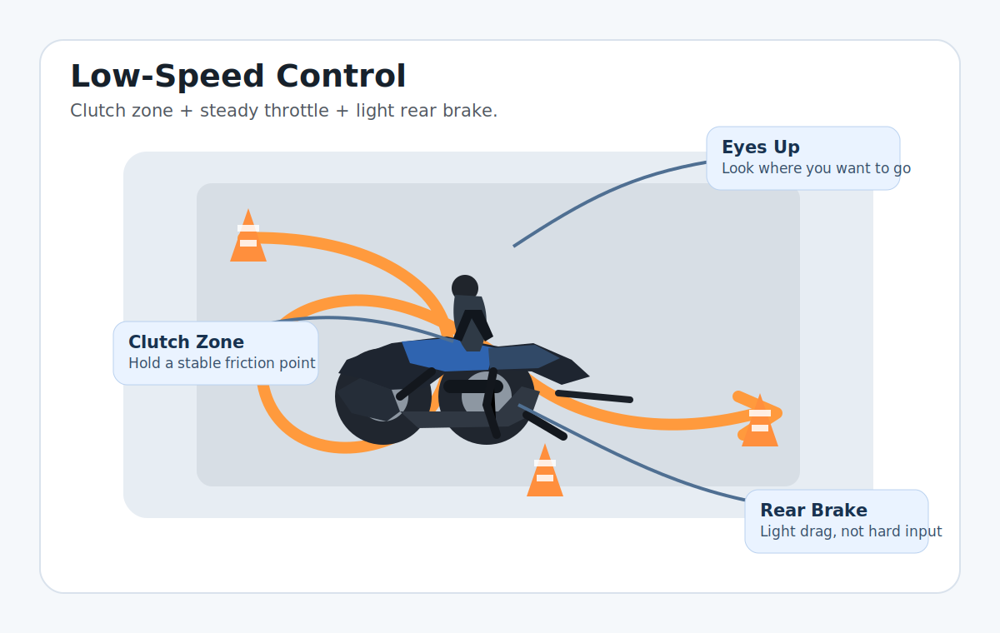

# Motorcycle Learning & DL250 Tutorial

这是一个围绕豪爵铃木 `DL250` 整理的新手学习项目，目标不是“快速上手就敢乱骑”，而是让你按顺序建立一套更稳、更安全、更能长期坚持的骑行方法。

## 这套教程适合谁
- 刚拿到 `D/E` 证，准备从零开始骑摩托。
- 已经会基本起步，但对 `DL250` 的车重、低速控制、通勤实战还没信心。
- 想把“练车、装备、保养、复盘”整理成一条连续学习路径。

## 你该怎么用这个项目
1. 先读完本页，形成整体学习框架。
2. 按本页的顺序练，每次只练 1-2 个重点。
3. 练完后到 `docs/Learning_Log.md` 打卡和复盘。
4. 遇到专项问题，再去对应文档深入看。

## 教程地图
| 阶段 | 目标 | 重点内容 | 配套文档 |
| --- | --- | --- | --- |
| 第 0 步 | 认识车和风险 | 熟悉 `DL250` 特点、车重、使用场景 | `docs/DL250_Riding_Guide.md` |
| 第 1 步 | 安全出发 | 出车前检查、装备到位 | `docs/DL250_Maintenance.md` `docs/DL250_Gear_Guide.md` |
| 第 2 步 | 打牢基本功 | 起步、停车、换挡、制动 | `docs/Learning_Log.md` |
| 第 3 步 | 解决低速恐惧 | 半联动、轻后刹、窄路掉头、绕桩 | `docs/DL250_Riding_Guide.md` |
| 第 4 步 | 进入真实通勤 | 路口预判、防御性驾驶、盲区意识 | `docs/DL250_Riding_Guide.md` |
| 第 5 步 | 养成长期习惯 | 保养、复盘、按场景升级装备 | 全部文档 |

## 第 0 课：先认识 DL250
`DL250` 很适合新手长期学习，因为它稳定、成熟、容错高，但它并不是“特别轻松的小玩具车”。

你需要先接受 3 个事实：
- 这台车不轻，原地挪车、停车、掉头都比小踏板更讲究动作。
- 真正让新手紧张的，通常不是高速，而是低速。
- 学习顺序应该是“稳”优先，而不是“快”优先。

现阶段你的目标不是压弯，也不是追求速度，而是先做到：
- 起步不熄火
- 低速不慌张
- 停车不狼狈
- 通勤有预判
- 出车先检查

## 第 1 课：每次出发前先做检查
新手最值得尽早养成的习惯，不是改装，也不是刷视频，而是每次骑之前用 3 分钟看一遍车况。

出车前至少看这 6 项：
1. 轮胎：胎压、胎纹、异物、鼓包。
2. 刹车：前后刹手感是否正常。
3. 灯光：近光、远光、转向灯、刹车灯。
4. 油液：油量、冷却液、地面渗漏。
5. 链条：是否过松、过脏、缺油。
6. 车身：后视镜、边撑、护杠、尾箱是否牢固。

如果你还没形成习惯，直接配合 `docs/DL250_Maintenance.md` 使用，把“出车前 3 分钟检查”练成固定动作。

## 第 2 课：先把最基础的四件事练稳
对于 `DL250` 新手，优先级最高的 4 个基本动作是：

1. 起步
2. 停车
3. 升降挡
4. 渐进式制动

推荐训练顺序：
1. 练起步：离合慢慢到半联动，车有前拱感后再轻补油。
2. 练停车：车身尽量扶正，轻柔制动，稳定落左脚。
3. 练升挡：收油、升挡、补油，动作连贯。
4. 练降挡：先减速再降挡，避免拖挡闯车。

不要急着上复杂路况。只要起步、停车还不稳定，后面的绕桩、掉头、通勤都会放大你的紧张感。

## 第 3 课：低速控制是 DL250 学习核心
新手最容易卡住的地方，就是 `DL250` 的低速控制。真正有效的核心不是“憋住不敢动”，而是下面这个组合：

`半联动 + 稳油门 + 轻后刹`

练低速时要记住：
- 眼睛看远一点，看你想去的地方，不要盯地面。
- 掉头和绕桩时，先求不断脚，再求动作顺。
- 车身有角度时，不要突然猛捏前刹。
- 低速不稳时，优先想离合和后刹，不要只会突然收油。

推荐练习顺序：
1. 慢速直线滑行。
2. 大间距绕桩。
3. 宽 U 型掉头。
4. 逐步缩小掉头空间。
5. 坡道起步。

## 第 4 课：从场地过渡到城市通勤
通勤不是“会拧油门就能上路”，而是你有没有观察节奏和防御意识。

城市通勤最值得练的 4 件事：
- 绿灯起步前先扫左右行人和电动车。
- 跟车时给自己留刹车空间，不贴前车。
- 并线前先看后视镜，再回头确认盲区。
- 不在大车旁边长时间并行，不把自己放进盲区。

如果你第一次开始真实通勤，建议这样安排：
1. 先选熟悉路线。
2. 先避开早晚高峰。
3. 先白天再夜间。
4. 先短距离再长距离。

## 第 5 课：装备不是面子，是学习成本控制
对 `DL250` 新手来说，最常见的问题不是“高速飞出去”，而是低速倒车、原地挪车失误、窄路掉头慌张、雨天通勤打滑。

所以装备优先级应该是：
1. 全盔
2. 手套
3. 骑行靴
4. 骑行服
5. 骑行裤
6. 雨衣和反光装备

详细建议见 `docs/DL250_Gear_Guide.md`。一句话概括：先把头、手、脚和躯干的基础防护补齐，再考虑相机、对讲、改装件。

## 第 6 课：把保养变成骑行的一部分
`DL250` 不难养，但新手很容易只会骑，不会看车况。

你至少要记住这些高频项目：
- 机油：每 `5000km` 或一年。
- 首保：`1000km`。
- 链条：每 `500-1000km` 清洁润滑一次。
- 胎压：前 `2.5 bar`，后 `2.8 bar`。
- 冷却液：约两年更换一次。

如果你能做到“每周一次检查 + 每次骑前快速确认”，你对车的掌控感会明显提升。

## 一个适合新手的 30 天学习节奏
### 第 1 周
- 熟悉按键、边撑、熄火开关、油箱盖、大撑。
- 原地推车，适应车重。
- 只练起步、停车、半联动。

### 第 2 周
- 加入升降挡和渐进式制动。
- 开始大间距绕桩和宽 U 型掉头。

### 第 3 周
- 加入窄路掉头、坡道起步。
- 选择熟悉路段做短距离真实通勤。

### 第 4 周
- 开始复盘通勤中的路口、跟车、并线和盲区问题。
- 固定做出车前检查、洗车和链条保养。

## 学习时只抓这几个原则
- 每次只练 1-2 个目标。
- 先练慢，再练顺，最后才是复杂场景。
- 练不好时先减难度，不要硬顶。
- 出现紧张和手忙脚乱，先回到基础动作。
- 所有进步都记录到 `docs/Learning_Log.md`。

## 配套文档导航
- `docs/Learning_Log.md`：学习打卡、阶段进度、每周复盘。
- `docs/DL250_Riding_Guide.md`：围绕车重、低速、通勤、长途的专项指南。
- `docs/DL250_Gear_Guide.md`：装备优先级、预算分配和调研建议。
- `docs/DL250_Maintenance.md`：保养参数、出车前检查和异常排查。
- `docs/Resources.md`：视频、理论资料和社区入口。

## 建议你现在就开始的顺序
1. 今天先通读本页。
2. 打开 `docs/Learning_Log.md`，把当前状态填上。
3. 下次练车前，照着本页的“第 1 课”和“第 2 课”执行。
4. 练完后写一句复盘：今天最稳的动作是什么，最容易慌的动作是什么。

---
*Ride smooth, stay safe, and let progress be measurable.*
